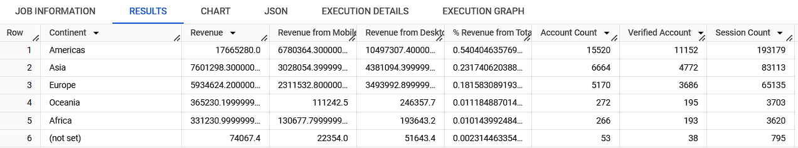

### Revenue by Device and Continent with Sessions
У цьому завданні результуючий набір має містити такі стовпчики:
| Continent | Revenue | Revenue from Mobile | Revenue from Desktop | % Revenue from Total | Account Count | Verified Account | Session Count |

```sql
WITH
  revenue_total AS (
  SELECT
    ssp.continent continent,
    sum (prd.price) revenue,
    sum (CASE
        WHEN ssp.device = 'mobile' THEN prd.price
    END
      ) mobile_revenue,
    sum (CASE
        WHEN ssp.device = 'desktop' THEN prd.price
    END
      ) desktop_revenue,
  FROM
    `DA.order` ord
  JOIN
    `DA.product` prd
  ON
    ord.item_id = prd.item_id
  JOIN
    `DA.session_params` ssp
  ON
    ord.ga_session_id = ssp.ga_session_id
  GROUP BY
    ssp.continent ),
  sessions AS (
  SELECT
    ssp.continent continent,
    count (acc.id) account_count,
    count (CASE
        WHEN acc.is_verified = 1 THEN acc.is_verified
    END
      ) verified_account,
    count (sss.ga_session_id) session_count
  FROM
    `DA.session` sss
  LEFT JOIN
    `DA.account_session` acs
  ON
    sss.ga_session_id = acs.ga_session_id
  LEFT JOIN
    `DA.account` acc
  ON
    acs.account_id = acc.id
  JOIN
    `DA.session_params` ssp
  ON
    sss.ga_session_id = ssp.ga_session_id
  GROUP BY
    ssp.continent )
SELECT
  revenue_total.continent `Continent`,
  revenue `Revenue`,
  mobile_revenue `Revenue from Mobile`,
  desktop_revenue `Revenue from Desktop`,
  (mobile_revenue + desktop_revenue) / SUM(revenue) OVER () AS `% Revenue from Total`,
  account_count `Account Count`,
  verified_account `Verified Account`,
  session_count `Session Count`
FROM
  revenue_total
LEFT JOIN
  sessions
ON
  revenue_total.continent = sessions.continent
ORDER BY
  `% Revenue from Total` DESC
```


