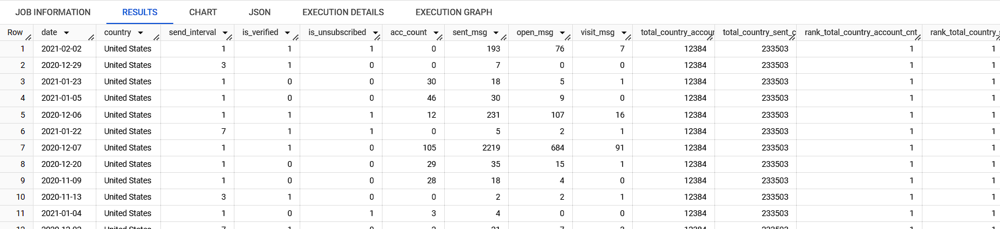

Необхідно зібрати дані, які допоможуть аналізувати динаміку створення акаунтів, активність користувачів за листами (відправлення, відкриття, переходи), 
а також оцінювати поведінку в категоріях, таких як інтервал відправлення, верифікація акаунтів і статус підписки.
Дані дозволять порівнювати активність між країнами, визначати ключові ринки, сегментувати користувачів за різними параметрами.
date — дата (для акаунтів - дата створення акаунта, для емейлів - дата відправки емейла);
country — країна;
send_interval — інтервал відправлення, встановлений акаунтом;
is_verified — перевірено акаунт чи ні;
is_unsubscribed — підписник відписався чи ні.
account_cnt — кількість створених акаунтів;
sent_msg — кількість відправлених листів;
open_msg — кількість відкритих листів;
visit_msg — кількість переходів по листах;
total_country_account_cnt — загальна кількість створених підписників в цілому по країні;
total_country_sent_cnt — загальна кількість відправлених листів в цілому по країні;
rank_total_country_account_cnt — рейтинг країн за кількістю створених підписників в цілому по країні;
rank_total_country_sent_cnt — рейтинг країн за кількістю відправлених листів в цілому по країні.

```sql
-- підготували перелік акаунтів
WITH
  account_date AS (
  SELECT
    sss.date date,
    acc.id account_id,
    ssp.country country,
    acc.send_interval send_interval,
    acc.is_verified is_verified,
    acc.is_unsubscribed is_unsubscribed
  FROM
    `DA.account` acc
  JOIN
    `DA.account_session` acs
  ON
    acc.id = acs.account_id
  JOIN
    `DA.session` sss
  ON
    acs.ga_session_id = sss.ga_session_id
  JOIN
    `DA.session_params` ssp
  ON
    acs.ga_session_id = ssp.ga_session_id
  WHERE
    ssp.country != '(not set)' ),


-- додали показники підписки


  acc_list AS (
SELECT
  account_date.date date,
  account_date.country country,
  acc.send_interval send_interval,
  acc.is_verified is_verified,
  acc.is_unsubscribed is_unsubscribed,
  count (acc.id) acc_count
FROM
  `DA.account` acc
JOIN
  account_date
ON
  account_date.account_id = acc.id
GROUP BY
  date,
  country,
  send_interval,
  is_verified,
  is_unsubscribed ),


-- підраховуємо показники e-mails
  email_metric AS (
SELECT
  DATE_ADD(account_date.date, INTERVAL ems.sent_date day) AS sent_date,
  account_date.country country,
  account_date.send_interval send_interval,
  account_date.is_verified is_verified,
  account_date.is_unsubscribed is_unsubscribed,
  COUNT(DISTINCT ems.id_message) AS sent_msg,
  COUNT(DISTINCT emo.id_message) AS open_msg,
  COUNT(DISTINCT emv.id_message) AS visit_msg
FROM
  `DA.email_sent`ems
JOIN
  account_date
ON
  ems.id_account = account_date.account_id
LEFT JOIN
  `DA.email_open`emo
ON
  ems.id_message = emo.id_message
LEFT JOIN
  `DA.email_visit`emv
ON
  ems.id_message = emv.id_message
GROUP BY
  1,2, send_interval, is_verified, is_unsubscribed),


-- перше поєднання
  account_unite AS (
SELECT
  date,
  country,
  send_interval,
  is_verified,
  is_unsubscribed,
  acc_count,
  0 AS sent_msg,
  0 AS open_msg,
  0 AS visit_msg
FROM
  acc_list
UNION ALL
SELECT
  sent_date,
  country,
  send_interval,
  is_verified,
  is_unsubscribed,
  0 AS acc_count,
  sent_msg,
  open_msg,
  visit_msg
FROM
  email_metric ),


--друге поєднання
  upgraded_union AS (
SELECT
  date,
  country,
  send_interval,
  is_verified,
  is_unsubscribed,
  SUM(acc_count) AS acc_count,
  SUM(sent_msg) AS sent_msg,
  SUM(open_msg) AS open_msg,
  SUM(visit_msg) AS visit_msg
FROM
  account_unite
GROUP BY
  date,
  country,
  send_interval,
  is_verified,
  is_unsubscribed ),


-- рахуємо count
  count_part AS (
SELECT
  *,
  SUM(acc_count) OVER (PARTITION BY country) AS total_country_account_cnt,
  SUM(sent_msg) OVER (PARTITION BY country) AS total_country_sent_cnt
FROM
  upgraded_union ),


-- робимо топ
  top_part AS(
SELECT
  *,
  DENSE_RANK() OVER (ORDER BY total_country_account_cnt DESC) AS rank_total_country_account_cnt,
  DENSE_RANK() OVER (ORDER BY total_country_sent_cnt DESC) AS rank_total_country_sent_cnt
FROM
  count_part )
SELECT
  *
FROM
  top_part
WHERE
  rank_total_country_account_cnt <= 10
  OR rank_total_country_sent_cnt <= 10
ORDER BY
  rank_total_country_account_cnt,
  rank_total_country_sent_cnt


